<!--
  Generated by scripts/build_profile.py. Edit the script, not this file.
  Refreshed automatically by .github/workflows/profile.yml (last run: 2026-09-24 17:16 UTC).
-->

<picture>
  <source media="(prefers-color-scheme: dark)" srcset="https://raw.githubusercontent.com/T3lluz/T3lluz/main/assets/titles/glitch-hey-dark.svg" />
  <source media="(prefers-color-scheme: light)" srcset="https://raw.githubusercontent.com/T3lluz/T3lluz/main/assets/titles/glitch-hey-light.svg" />
  
</picture>

  Bachelor in computer engineering, from Norway. 
  Working on  <a href="https://github.com/T3lluz/DailyDash"><b>DailyDash</b></a>,  <a href="https://github.com/T3lluz/PorcoRosso"><b>PorcoRosso</b></a>,  <a href="https://github.com/T3lluz/Cinema-Info"><b>Cinema-Info</b></a>.

 

---

  <picture>
    <source media="(prefers-color-scheme: dark)" srcset="https://raw.githubusercontent.com/T3lluz/T3lluz/main/assets/titles/glitch-about-dark.svg" />
    <source media="(prefers-color-scheme: light)" srcset="https://raw.githubusercontent.com/T3lluz/T3lluz/main/assets/titles/glitch-about-light.svg" />
    
  </picture>  
  
  
  
  
  
    
  <table align="center" width="100%">
    <tbody>
      <tr>
        <td align="center">
          <picture>
            <source media="(prefers-color-scheme: dark)" srcset="https://raw.githubusercontent.com/T3lluz/T3lluz/main/assets/about/about-carousel-dark.svg" />
            <source media="(prefers-color-scheme: light)" srcset="https://raw.githubusercontent.com/T3lluz/T3lluz/main/assets/about/about-carousel-light.svg" />
            
          </picture>
        </td>
      </tr>
    </tbody>
  </table>

Text version

**`whoami`**

- bachelor in computer engineering, Norway
- on GitHub for 4y 9m
- 1,410 contributions in the last year

**`git log --oneline -3`**

- PorcoRosso: Point RSVP at the real form and serve from skagesogsusans… (4 days ago)
- PorcoRosso: Changed Lorem Ipsum placeholder with "Kommer snart" (2 weeks ago)
- PorcoRosso: Added second location, removed PorcoRosso logo, improved… (2 weeks ago)

**`ls ~/projects --active`**

- DailyDash: 109 commits this month, Android dashboard: health, weather, F1, Git…
- PorcoRosso: 20 commits this month, React 19 + Vite site published on GitHub Pa…
- Cinema-Info: 4 commits this month, Live cinema schedule with seats, times and…

**`cat stack.txt`**

- last 90 days: JavaScript 38%, Kotlin 33%, CSS 14%, TypeScript 8%
- web: Supabase, Node.js, Playwright, Chrome extensions, Vite
- apps: Room / SQLite, Ktor, Jetpack Compose, Android, Qt / QML

**`gh stats`**

- 1,059 commits, 215 pull requests, 22 issues
- current streak: 2 days (best 11)
- 115 active days, most of them on Fridays

**`cat interests.txt`**

- android apps
- kde plasma widgets and stream deck plugins
- browser extensions and small web apps

---

  <picture>
    <source media="(prefers-color-scheme: dark)" srcset="https://raw.githubusercontent.com/T3lluz/T3lluz/main/assets/titles/glitch-pulse-dark.svg" />
    <source media="(prefers-color-scheme: light)" srcset="https://raw.githubusercontent.com/T3lluz/T3lluz/main/assets/titles/glitch-pulse-light.svg" />
    
  </picture>  
  <a href="https://github.com/T3lluz?tab=overview">
  <picture>
    <source media="(prefers-color-scheme: dark)" srcset="https://raw.githubusercontent.com/T3lluz/T3lluz/main/assets/stats/pulse-dark.svg" />
    <source media="(prefers-color-scheme: light)" srcset="https://raw.githubusercontent.com/T3lluz/T3lluz/main/assets/stats/pulse-light.svg" />
    
  </picture>
  </a>

  <picture>
    <source media="(prefers-color-scheme: dark)" srcset="https://raw.githubusercontent.com/T3lluz/T3lluz/main/assets/snake/github-contribution-grid-snake-neon.svg" />
    <source media="(prefers-color-scheme: light)" srcset="https://raw.githubusercontent.com/T3lluz/T3lluz/main/assets/snake/github-contribution-grid-snake.svg" />
    
  </picture>

---

  <picture>
    <source media="(prefers-color-scheme: dark)" srcset="https://raw.githubusercontent.com/T3lluz/T3lluz/main/assets/titles/glitch-stack-dark.svg" />
    <source media="(prefers-color-scheme: light)" srcset="https://raw.githubusercontent.com/T3lluz/T3lluz/main/assets/titles/glitch-stack-light.svg" />
    
  </picture>  
  <table align="center" width="100%">
    <tbody>
      <tr valign="top">
        <td align="center" width="50%">
          <b>Languages</b> last 90 days  
          
          
          
          
          
          
           JavaScript 38%, Kotlin 33%, CSS 14%, TypeScript 8%, Python 3%, HTML 2%
        </td>
        <td align="center" width="50%">
          <b>Frameworks</b> used in my active repos  
          
          
          
          
          
          
          
          
          
          
          
          
           PostgreSQL, Supabase, Room / SQLite, Ktor, Jetpack Compose, Android, Node.js, Playwright, Chrome extensions, Vite, React, Qt / QML
        </td>
      </tr>
      <tr>
        <td align="center" colspan="2">
          <b>Tools</b>  
          
          
          
          
          
          
          
          
           Linux, Arch Linux, GitHub Actions, Cursor, Android Studio, Git, VS Code, VirtualBox VMs
        </td>
      </tr>
      <tr>
        <td align="center" colspan="2">
          <b>AI tools</b>  
          
          
          
          
           LM Studio, Hermes Agent, Cursor, Claude Code
        </td>
      </tr>
    </tbody>
  </table>

---

  <picture>
    <source media="(prefers-color-scheme: dark)" srcset="https://raw.githubusercontent.com/T3lluz/T3lluz/main/assets/titles/glitch-contact-dark.svg" />
    <source media="(prefers-color-scheme: light)" srcset="https://raw.githubusercontent.com/T3lluz/T3lluz/main/assets/titles/glitch-contact-light.svg" />
    
  </picture>  
  
  
  
  

  This page updates itself from my GitHub activity every few hours.

