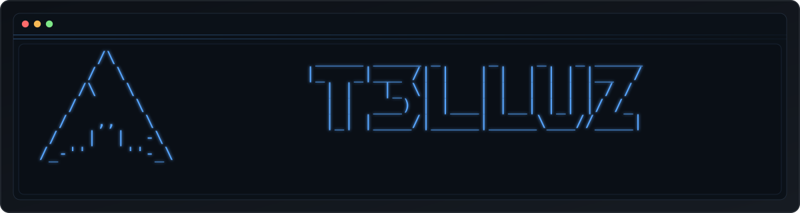

  Full-stack student building MERN/PERN apps, Stream Deck tools, local LLM workflows in LM Studio, and UI animation experiments.

 

---

    
  
  
    
  <table align="center" width="100%">
    <tbody>
      <tr>
        <td align="center">
          
        </td>
      </tr>
    </tbody>
  </table>

<strong>Plain checklist</strong>

**Who I am** · Student developer focused on practical web software with a bias toward clean UX and readable code.

**Stacks & tools**

| Lane | Detail |
| --- | --- |
| Web | JavaScript, React, Node.js, HTML/CSS |
| Data | Postgres, MongoDB, SQL + NoSQL patterns |
| Also | Kotlin, TypeScript, Python, Java |
| Local AI | LM Studio + OpenCLAW + Cursor IDE workflows |

**How I work**

| Habit | What it means |
| --- | --- |
| Deliverables | Break ideas into small, shippable slices |
| Code quality | Prioritize maintainability over cleverness |
| Product feel | DX and performance matter from day one |
| Sandbox | VMs for isolated testing & config experiments |

**Beyond coding** · Stream Deck + HID battery integrations, theme / animation tweaks, Linux/Windows setup tuning, local-LLM tinkering with LM Studio.

<strong>Fun mode</strong>

- If it has a config file, I will eventually touch it.
- "One small tweak" often becomes a full desktop refactor.
- I only test in production emotionally.
- `openclaw --provider lmstudio` has become muscle memory.

 

 

 

---

    
  

  <picture>
    <source media="(prefers-color-scheme: dark)" srcset="https://raw.githubusercontent.com/T3lluz/T3lluz/main/assets/snake/github-contribution-grid-snake-neon.svg" />
    <source media="(prefers-color-scheme: light)" srcset="https://raw.githubusercontent.com/T3lluz/T3lluz/main/assets/snake/github-contribution-grid-snake.svg" />
    
  </picture>

---

    
  

  <table align="center" border="0" cellspacing="0" cellpadding="0" width="100%" style="width:100%;table-layout:fixed;border-collapse:separate;border-spacing:0;border:1px solid rgba(88,166,255,0.38);border-radius:10px;overflow:hidden;background:rgba(13,17,23,0.35);">
    <colgroup><col style="width:50%;" /><col style="width:50%;" /></colgroup>
    <tbody>
      <tr valign="top">
        <td align="center" style="padding:14px 6px 22px;border-right:1px solid rgba(88,166,255,0.22);vertical-align:top;">
          
Core stack

          

          
          
          
          
          
          
          
          

        </td>
        <td align="center" style="padding:14px 6px 22px;vertical-align:top;">
          
Also building with

          

          
          
          
          
          
          
          

        </td>
      </tr>
      <tr>
        <td align="center" colspan="2" style="padding:14px 10px 18px;border-top:1px solid rgba(88,166,255,0.22);vertical-align:top;">
          
Environment and tooling

          

          
          
          
          
          
          
          
          

        </td>
      </tr>
    </tbody>
  </table>
  

   

  
Local AI workflow

  

    <code style="color:#b6d9ff;background:rgba(15,23,42,0.72);border:1px solid rgba(88,166,255,0.55);box-shadow:0 0 6px rgba(88,166,255,0.15);padding:4px 10px;border-radius:6px;">LM Studio</code>
     · 
    <code style="color:#b6d9ff;background:rgba(15,23,42,0.72);border:1px solid rgba(88,166,255,0.55);box-shadow:0 0 6px rgba(88,166,255,0.15);padding:4px 10px;border-radius:6px;">OpenCLAW</code>
     · 
    <code style="color:#b6d9ff;background:rgba(15,23,42,0.72);border:1px solid rgba(88,166,255,0.55);box-shadow:0 0 6px rgba(88,166,255,0.15);padding:4px 10px;border-radius:6px;">Cursor IDE</code>
     · 
    <code style="color:#b6d9ff;background:rgba(15,23,42,0.72);border:1px solid rgba(88,166,255,0.55);box-shadow:0 0 6px rgba(88,166,255,0.15);padding:4px 10px;border-radius:6px;">VM-based test setups</code>
  

---

    
  
  
  

  Open to collaboration, student projects, and cool build ideas.

