<!--
  Generated by scripts/build_profile.py — edit the script, not this file.
  Refreshed daily by .github/workflows/profile.yml (last run: 2026-09-16).
-->

<picture>
  <source media="(prefers-color-scheme: dark)" srcset="https://raw.githubusercontent.com/T3lluz/T3lluz/main/assets/titles/glitch-hey-dark.svg" />
  <source media="(prefers-color-scheme: light)" srcset="https://raw.githubusercontent.com/T3lluz/T3lluz/main/assets/titles/glitch-hey-light.svg" />
  
</picture>

  Computer engineering (bachelor) · based in Norway. 
  I build the tools I want to use every day:
  Android apps, React web apps, KDE Plasma widgets and Stream Deck plugins.

  
  
  

---

<picture>
  <source media="(prefers-color-scheme: dark)" srcset="https://raw.githubusercontent.com/T3lluz/T3lluz/main/assets/titles/glitch-about-dark.svg" />
  <source media="(prefers-color-scheme: light)" srcset="https://raw.githubusercontent.com/T3lluz/T3lluz/main/assets/titles/glitch-about-light.svg" />
  
</picture>

<picture>
  <source media="(prefers-color-scheme: dark)" srcset="https://raw.githubusercontent.com/T3lluz/T3lluz/main/assets/about/about-carousel-dark.svg" />
  <source media="(prefers-color-scheme: light)" srcset="https://raw.githubusercontent.com/T3lluz/T3lluz/main/assets/about/about-carousel-light.svg" />
  
</picture>

<strong>Plain-text version</strong>

**cat whoami.txt**

- bachelor in computer engineering · based in Norway
- 4y 9m on GitHub · 1,346 contributions in the last year
- I build the tools I actually want to use, then keep polishing them

**ls ~/projects --sort=recent**

- Cinema-Info — Live cinema schedule with seats, times and posters for Buen K…
- DailyDash — Android dashboard: health, weather, F1, GitHub and servers on…
- PorcoRosso — React 19 + Vite site published on GitHub Pages

**tokei ~/code --sort code**

- languages: Kotlin 42% · JavaScript 19% · TypeScript 12% · CSS 7%
- web: React 19 · Vite · TypeScript · Tailwind · Supabase
- apps: Kotlin + Jetpack Compose · Qt/QML Plasma widgets · Python

**gh stats --year**

- 989 commits · 201 pull requests · 22 issues
- longest streak this year: 22 days in a row
- 111 active days · most productive on Fridays

**cat ~/.enjoy**

- turning small daily annoyances into polished little tools
- Linux desktop hacking: Plasma widgets, Stream Deck plugins, HID
- sweating the details: motion, theming and how an app feels

---

<picture>
  <source media="(prefers-color-scheme: dark)" srcset="https://raw.githubusercontent.com/T3lluz/T3lluz/main/assets/titles/glitch-building-dark.svg" />
  <source media="(prefers-color-scheme: light)" srcset="https://raw.githubusercontent.com/T3lluz/T3lluz/main/assets/titles/glitch-building-light.svg" />
  
</picture>

| Project | What it is | Lang | Last push |
| --- | --- | --- | --- |
| [**Cinema-Info**](https://github.com/T3lluz/Cinema-Info) | Live cinema schedule with seats, times and posters for Buen Kino | JavaScript | Sep 2026 |
| [**DailyDash**](https://github.com/T3lluz/DailyDash) | Android dashboard: health, weather, F1, GitHub and servers on one screen | Kotlin | Sep 2026 |
| [**PorcoRosso**](https://github.com/T3lluz/PorcoRosso) | React 19 + Vite site published on GitHub Pages | JavaScript | Sep 2026 |
| [**Power-Deck**](https://github.com/T3lluz/Power-Deck) | Plasma panel widget for ROG laptop power modes and hardware controls. | QML | Aug 2026 |
| [**ChroMods**](https://github.com/T3lluz/ChroMods) | Chromium css theming for requested sites | JavaScript | Aug 2026 |
| [**YTMQ**](https://github.com/T3lluz/YTMQ) | Youtube music shared queue connection | TypeScript | Aug 2026 |

Sorted by most recent push · updated automatically every day.

---

<picture>
  <source media="(prefers-color-scheme: dark)" srcset="https://raw.githubusercontent.com/T3lluz/T3lluz/main/assets/titles/glitch-pulse-dark.svg" />
  <source media="(prefers-color-scheme: light)" srcset="https://raw.githubusercontent.com/T3lluz/T3lluz/main/assets/titles/glitch-pulse-light.svg" />
  
</picture>

<picture>
  <source media="(prefers-color-scheme: dark)" srcset="https://raw.githubusercontent.com/T3lluz/T3lluz/main/assets/stats/pulse-dark.svg" />
  <source media="(prefers-color-scheme: light)" srcset="https://raw.githubusercontent.com/T3lluz/T3lluz/main/assets/stats/pulse-light.svg" />
  
</picture>

  

<picture>
  <source media="(prefers-color-scheme: dark)" srcset="https://raw.githubusercontent.com/T3lluz/T3lluz/main/assets/snake/github-contribution-grid-snake-neon.svg" />
  <source media="(prefers-color-scheme: light)" srcset="https://raw.githubusercontent.com/T3lluz/T3lluz/main/assets/snake/github-contribution-grid-snake.svg" />
  
</picture>

---

<picture>
  <source media="(prefers-color-scheme: dark)" srcset="https://raw.githubusercontent.com/T3lluz/T3lluz/main/assets/titles/glitch-stack-dark.svg" />
  <source media="(prefers-color-scheme: light)" srcset="https://raw.githubusercontent.com/T3lluz/T3lluz/main/assets/titles/glitch-stack-light.svg" />
  
</picture>

**Languages I ship in** (ordered by how much code is in my repos)

  
  
  
  
  
  

**Frameworks & platforms**

  
  
  
  
  
  
  
  
  
  

**Daily setup**

  
  
  
  
  
  
  
  
  
  

---

<picture>
  <source media="(prefers-color-scheme: dark)" srcset="https://raw.githubusercontent.com/T3lluz/T3lluz/main/assets/titles/glitch-contact-dark.svg" />
  <source media="(prefers-color-scheme: light)" srcset="https://raw.githubusercontent.com/T3lluz/T3lluz/main/assets/titles/glitch-contact-light.svg" />
  
</picture>

Always up for talking about side projects, Linux desktops and good tooling.

